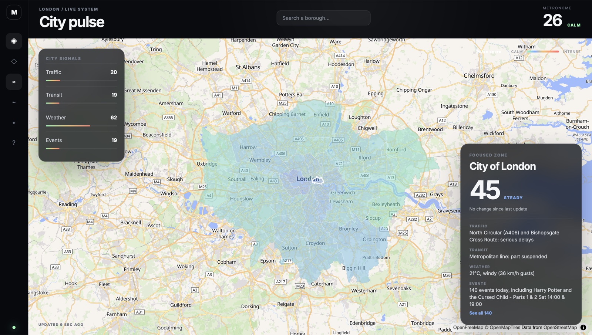

# Metronome

A live "city pulse" dashboard for London: four independent real-time data sources — traffic, transit, weather, and events — fused into a single 0–100 score for each of the city's 32 boroughs plus the City of London, shown on an interactive map.



## What it does

- **33 real London zones** — actual borough boundary shapes (not placeholder squares), simplified server-side via PostGIS so the map stays fast.
- **Four live signals, all real data:**
  - **Traffic** — TfL's road corridor status (~24 major roads, matched to each borough by geography)
  - **Transit** — TfL line status across Tube, DLR, Overground, Elizabeth line, and Tram, matched to each borough by which lines actually serve it (not a hardcoded lookup table)
  - **Weather** — live conditions via Open-Meteo
  - **Events** — ticketed events happening today nearby, via Ticketmaster
- **Plain-language explanations, not just numbers** — every signal comes with a real sentence naming what's behind it (e.g. *"North Circular (A406) and A12: serious delays"*, *"Jubilee line: part suspended"*), generated server-side from the same data driving the score.
- **A composite pulse score (0–100)** per borough, bucketed into five bands (CALM → STEADY → ELEVATED → BUSY → INTENSE), plus a global city-wide score.
- **Interactive dashboard:** search any borough by name, switch the map's color layer between the composite score and each individual signal, see active alerts (boroughs currently BUSY/INTENSE) and boroughs with events happening right now, and expand a borough's full event list on demand.
- **Auto-refreshing** every 30 seconds, with delta tracking so you can see a borough's score moving.

## Data sources

| Signal | Source | Auth |
|---|---|---|
| Traffic | [TfL Road API](https://api.tfl.gov.uk) | None |
| Transit | [TfL Line API](https://api.tfl.gov.uk) | None |
| Weather | [Open-Meteo](https://open-meteo.com) | None |
| Events | [Ticketmaster Discovery API](https://developer.ticketmaster.com) | Free API key |
| Map tiles | [OpenFreeMap](https://openfreemap.org) | None |
| Borough boundaries | Bundled GeoJSON (public domain reference data) | — |

Three of four live signals need zero signup at all. Only Events requires a free Ticketmaster developer account — the app runs fine without it, falling back to a neutral placeholder value for that one signal.

## Stack

- **Backend**: FastAPI (Python 3.12), async SQLAlchemy + [GeoAlchemy2](https://geoalchemy-2.readthedocs.io), httpx
- **Database**: PostgreSQL 16 + PostGIS (via Docker)
- **Frontend**: React + TypeScript + Vite, [MapLibre GL](https://maplibre.org) for the map
- **Migrations**: Alembic

## Getting started

### 1. Database

```bash
cp .env.example .env
docker compose up -d postgres
```

### 2. Backend

```bash
cd backend
python3 -m venv .venv && source .venv/bin/activate
pip install -r requirements.txt
python -m scripts.seed_zones   # loads all 33 London boroughs into Postgres
uvicorn app.main:app --reload
```

Health check: `curl http://localhost:8000/health`

To enable live events, grab a free key from [developer.ticketmaster.com](https://developer.ticketmaster.com) and add it to `backend/.env`:

```
TICKETMASTER_API_KEY=your-key-here
```

### 3. Frontend

```bash
cd frontend
cp .env.example .env
npm install
npm run dev
```

Open http://localhost:5173

## Deployment

Live stack: **Supabase** (Postgres + PostGIS), **Render** (backend), **Vercel** (frontend) — all free tier, no credit card required for any of them.

### 1. Database (Supabase)

1. Create a project at [supabase.com](https://supabase.com).
2. In the SQL Editor, run `create extension if not exists postgis;`.
3. Copy the connection string from **Project Settings → Database** (use the direct connection, not the pooler - a single always-on backend instance doesn't need connection pooling).
4. Seed it once, from your machine, pointing at Supabase instead of local Postgres:
   ```bash
   cd backend
   DATABASE_URL="<supabase connection string, with +asyncpg after postgresql>" \
   DATABASE_SSL=true \
     python -m scripts.seed_zones
   ```

### 2. Backend (Render)

This repo includes a `render.yaml` blueprint. In the Render dashboard: **New → Blueprint**, point it at this repo, and it'll pick up `metronome-backend` automatically. You'll be prompted for:

- `DATABASE_URL` — the same Supabase connection string as above
- `CORS_ORIGINS` — leave a placeholder for now (e.g. `http://localhost:5173`); you'll update it once the frontend is deployed
- `TICKETMASTER_API_KEY` — optional

`DATABASE_SSL` is already set to `true` in the blueprint. Render will build straight from `backend/Dockerfile`. Free tier sleeps after 15 minutes of inactivity — the first request after a while takes 30-60 seconds to wake up.

### 3. Frontend (Vercel)

1. Import this repo into Vercel, setting **Root Directory** to `frontend`.
2. Add an environment variable: `VITE_API_BASE_URL` = your Render backend's URL (e.g. `https://metronome-backend.onrender.com`).
3. Deploy.

### 4. Close the loop

Back in Render, update `CORS_ORIGINS` to your actual Vercel URL and redeploy the backend - until then, the frontend's requests will be blocked by CORS.

## How the score works

Each of the four signals is normalized to 0–1, then combined with fixed weights (see `backend/app/services/scoring.py`) into a single 0–100 pulse score. The scoring logic itself never touches the network — it's a pure function over whatever signal values it's given, whether those came from a live API or a fallback default. Each ingestion adapter (`backend/app/services/ingestion/`) is independent and interchangeable: if one source is down or unconfigured, that one signal falls back gracefully without breaking the others.

## Notable engineering details

A few things that came up building this that felt worth a mention:

- **Geometry simplification.** The raw borough boundary data is ~1.3MB of coordinates. Simplifying via PostGIS's `ST_SimplifyPreserveTopology` on seed (not on every request) cut that by roughly 90% while keeping the shapes recognizable — the tradeoff between fidelity and payload size is made once, at seed time, not on every poll.
- **A real concurrency bug, caught by looking for it.** With 33 boroughs each triggering their own transit-status fetch, an unguarded cache-miss check meant a cold cache could fire ~660 simultaneous requests to TfL (33 zones × 20 lines' worth of station lookups), which got rejected en masse — and every zone silently fell back to an identical mock value. Found by noticing all 33 zones showed the *exact same* number, not by assuming the fallback path was fine. Fixed with a lock-guarded, double-checked cache shared across concurrent callers.
- **Bounding-box tradeoffs, documented in the code.** Matching a TfL road corridor or Tube line to a borough uses bounding-box overlap, not true point-in-polygon — cheaper and sufficient for a borough-level signal, at the cost of occasional edge-case overreach (e.g. a station just outside a borough's true shape but inside its bounding box). Called out explicitly rather than quietly accepted.
- **Calibrated against real data, not guessed.** The event-density and traffic-congestion normalization curves were tuned by actually checking live value ranges (e.g. event counts spanning 3–160+ across boroughs) rather than picking round numbers up front.

## Repo layout

```
backend/
  app/
    api/routes/          # FastAPI routers (health, zones)
    core/                # settings
    db/                  # SQLAlchemy engine/session/base
    models/              # ORM models (PostGIS geometry column lives here)
    schemas/             # Pydantic response models
    services/
      ingestion/         # one file per live data source, all independent
      scoring.py         # pure scoring function
      mock_signals.py    # fallback values when a live fetch fails
  scripts/
    seed_zones.py        # loads the 33 London boroughs into Postgres
    data/                # bundled borough boundary GeoJSON
  alembic/                # database migrations
frontend/
  src/
    components/          # MapView, Rail, Search, ZoneCard, SignalsPanel, etc.
    lib/                 # API client, scoring/layer helpers
docker-compose.yml        # Postgres/PostGIS for local dev
render.yaml                # Render blueprint for the backend
```
